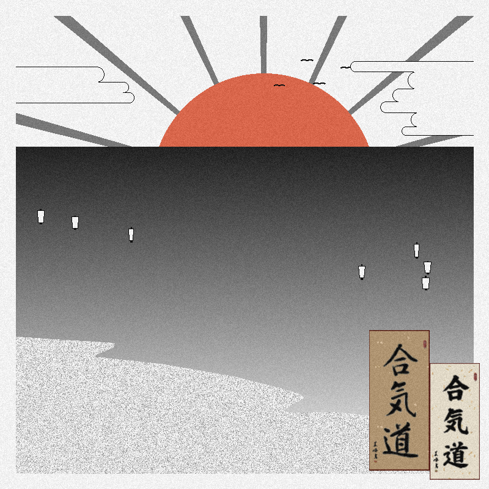
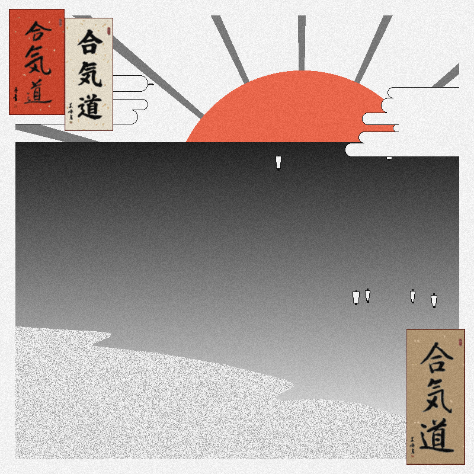

# Japanese Style Image Generator

This Python script generates a Japanese-style image with various elements such as sun, ocean, sand, boats, birds, clouds, borders, and artwork (kakejiku).

## Features

- Generates a Japanese-style image with customizable elements.
- Supports randomization and normal distributions for natural-looking placement of elements.
- Allows customization of parameters such as sun size, ocean gradient, boat placement, bird placement, cloud placement, and more.

## Requirements

- Python 3.x
- PIL (Python Imaging Library)
- NumPy
- PyTorch

## Installation

1. Clone the repository:

    ```
    git clone https://github.com/ClozeLine/JapaneseArtGen.git
    ```

2. Install the required dependencies:

    ```
    pip install pillow numpy torch
    ```

## Usage

1. Run the script `MainGen.py`:

    ```
    python MainGen.py
    ```

2. Customize the parameters within the script to adjust the elements of the generated image.

## Elements

- **Sun**: Randomly positioned and colored sun (red hue).
- **Ocean**: Gradient-filled ocean.
- **Sand**: Sandy fill within specified polygon boundaries.
- **Boats**: Randomly placed boats with sails and masts.
- **Birds**: Birds in the sky.
- **Clouds**: Clouds scattered across the sky.
- **Artwork**: Japanese artwork (kakejiku) pasted on the canvas.

## Preview




## Note

- Artwork images for kakejiku should be placed in the `Kakejiku` folder with filenames `kakejiku_1.png`, `kakejiku_2.png`, etc. (Make sure to change the randint() for image selection)

Feel free to modify and experiment with the code to create your own unique Japanese-style images!

## Contributing

Contributions are welcome! Feel free to fork the repository and submit pull requests.

## License

This project is licensed under the Creative Commons License - see the [LICENSE](LICENSE) file for details.
